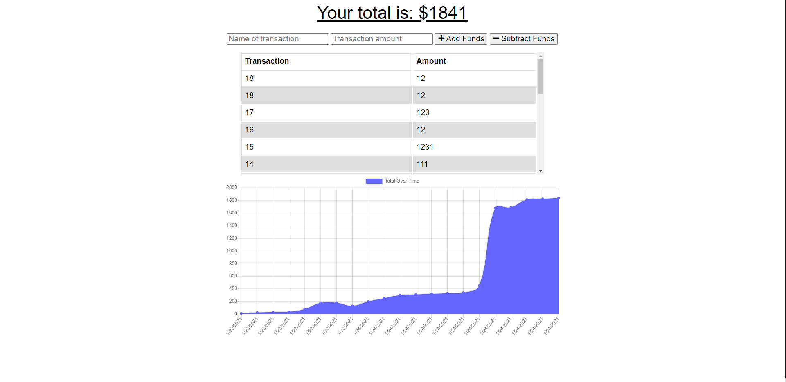

# Budget Tracker

  ## Description
An app that can track your withdrawals and deposits online or offline, good for traveling!

  ## Table of Contents

  * [Installation](#installation)
  * [Pcitures](#pictures)
  * [License](#license)
  * [Features](#features)
  * [Credits](#credits)

  ## Installation
        
  Once downloading, install the packages with "npm install" in node. Application will execute on "npm start".
  
  ## Pictures

  
  

      
  ## License
  MIT
   
  [See MIT License](https://choosealicense.com/licenses/mit)

  ## Features
    
  Able to use this app for budgeting and showing use of inexDB and service worker.

 ## Credits
    
  Contributor: Darryl Simpson  
  GitHub: https://github.com/DarrylSimpson